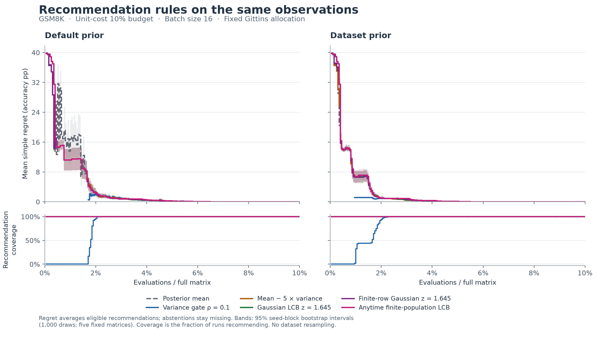

# GSM8K recommendation figures

The follow-up has a separate [PIQA and MMLU figure index](FIGURES_PIQA_MMLU.md).

All comparisons use identical observations within a run. Each figure shows both priors, mean simple regret, and recommendation coverage. Read missing gated regret together with coverage.

[Results and interpretation](RESULTS.md) · [Overview PNG](figures/gsm8k/overview.png) · [Overview PDF](figures/gsm8k/overview.pdf)

## Method families

- [baseline](figures/gsm8k/family_baseline.png)
- [confidence](figures/gsm8k/family_confidence.png)
- [finite gaussian lcb](figures/gsm8k/family_finite_gaussian_lcb.png)
- [gaussian lcb](figures/gsm8k/family_gaussian_lcb.png)
- [mean variance](figures/gsm8k/family_mean_variance.png)
- [variance gate](figures/gsm8k/family_variance_gate.png)

## Individual methods

- [Current posterior mean](figures/gsm8k/method_posterior_mean.png)
- [Observed sample mean](figures/gsm8k/method_empirical_mean.png)
- [Variance gate: v/v0 <= 0.5](figures/gsm8k/method_variance_gate_0.5.png)
- [Variance gate: v/v0 <= 0.2](figures/gsm8k/method_variance_gate_0.2.png)
- [Variance gate: v/v0 <= 0.1](figures/gsm8k/method_variance_gate_0.1.png)
- [Variance gate: v/v0 <= 0.05](figures/gsm8k/method_variance_gate_0.05.png)
- [Mean - 1 x variance](figures/gsm8k/method_mean_variance_1.png)
- [Mean - 5 x variance](figures/gsm8k/method_mean_variance_5.png)
- [Mean - 10 x variance](figures/gsm8k/method_mean_variance_10.png)
- [Mean - 20 x variance](figures/gsm8k/method_mean_variance_20.png)
- [Gaussian lower bound: mean - 1 x SD](figures/gsm8k/method_gaussian_lcb_1.png)
- [Gaussian lower bound: mean - 1.645 x SD](figures/gsm8k/method_gaussian_lcb_1.645.png)
- [Gaussian lower bound: mean - 1.96 x SD](figures/gsm8k/method_gaussian_lcb_1.96.png)
- [Gaussian lower bound: mean - 2.576 x SD](figures/gsm8k/method_gaussian_lcb_2.576.png)
- [Finite-row Gaussian bound: mean - 1 x SD](figures/gsm8k/method_finite_gaussian_lcb_1.png)
- [Finite-row Gaussian bound: mean - 1.645 x SD](figures/gsm8k/method_finite_gaussian_lcb_1.645.png)
- [Finite-row Gaussian bound: mean - 1.96 x SD](figures/gsm8k/method_finite_gaussian_lcb_1.96.png)
- [Anytime finite-population lower bound (delta=0.05)](figures/gsm8k/method_finite_population_lcb.png)

## Complete overview

