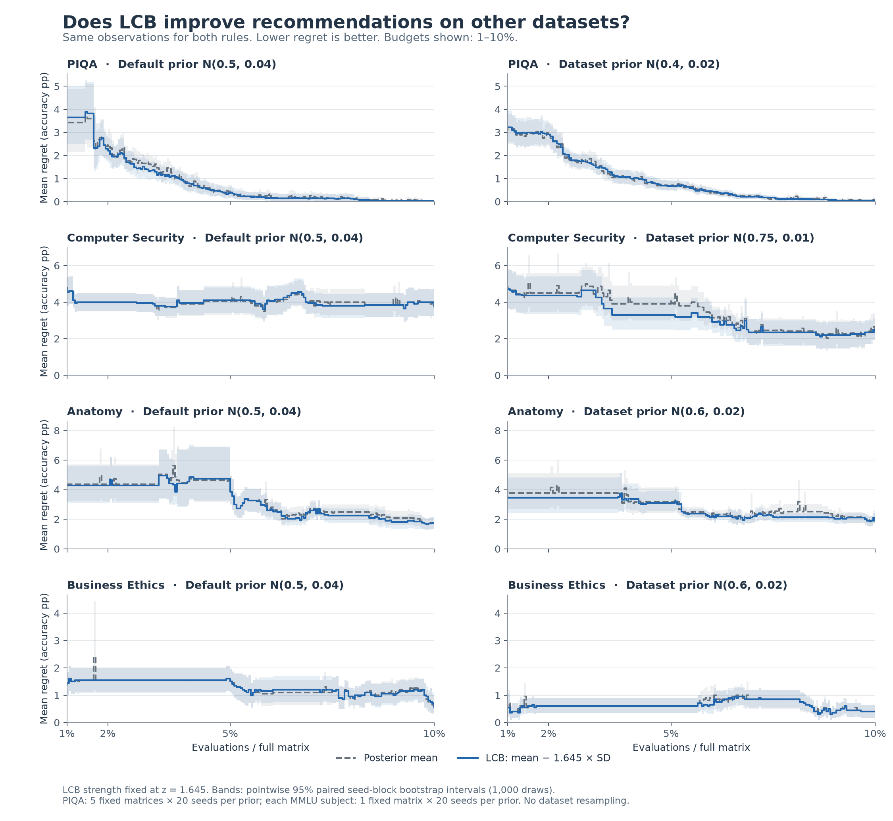
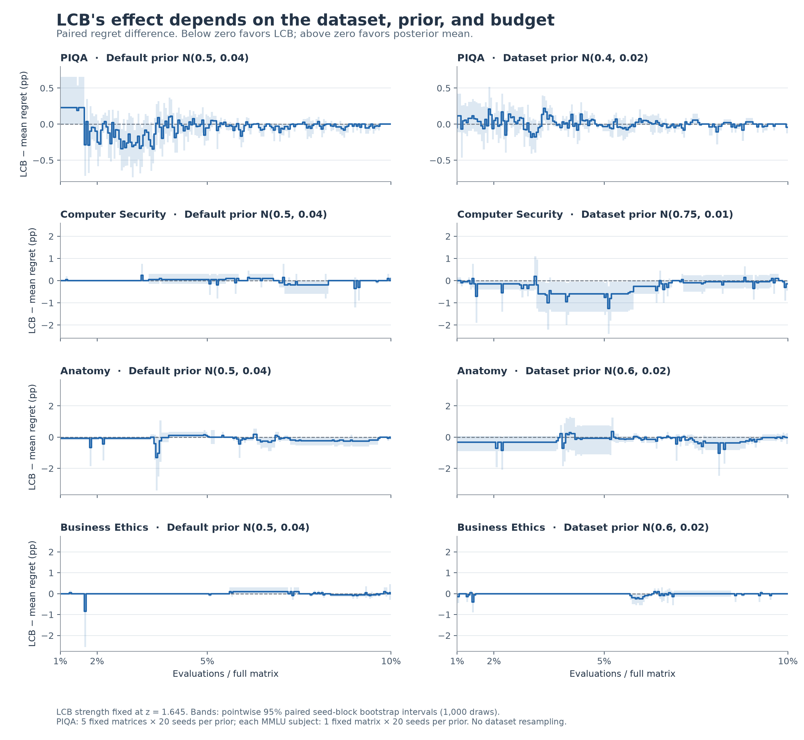

# PIQA and MMLU recommendation figures

All 18 rules receive identical observations within each trajectory. Each individual and family figure shows both priors, conditional mean regret, and recommendation coverage. An abstention has undefined regret; consult coverage when comparing gates.

[Results and interpretation](RESULTS_PIQA_MMLU.md) · [Cross-dataset mean regret](figures/piqa_mmlu/cross_dataset_lcb.png) · [Paired LCB effects](figures/piqa_mmlu/cross_dataset_lcb_effect.png) · [All checkpoint metrics](figures/piqa_mmlu/all_methods_checkpoints.csv)

## Dataset overviews

| Dataset | Overview | Paired final effects | All checkpoint metrics |
|---|---|---|---|
| PIQA | [PNG](figures/piqa/overview.png) / [PDF](figures/piqa/overview.pdf) | [Figure](figures/piqa/paired_final_delta.png) | [CSV](figures/piqa/budget_checkpoints.csv) |
| Computer Security | [PNG](figures/mmlu_computer_security/overview.png) / [PDF](figures/mmlu_computer_security/overview.pdf) | [Figure](figures/mmlu_computer_security/paired_final_delta.png) | [CSV](figures/mmlu_computer_security/budget_checkpoints.csv) |
| Anatomy | [PNG](figures/mmlu_anatomy/overview.png) / [PDF](figures/mmlu_anatomy/overview.pdf) | [Figure](figures/mmlu_anatomy/paired_final_delta.png) | [CSV](figures/mmlu_anatomy/budget_checkpoints.csv) |
| Business Ethics | [PNG](figures/mmlu_business_ethics/overview.png) / [PDF](figures/mmlu_business_ethics/overview.pdf) | [Figure](figures/mmlu_business_ethics/paired_final_delta.png) | [CSV](figures/mmlu_business_ethics/budget_checkpoints.csv) |

## Every individual rule

| Rule | PIQA | Computer Security | Anatomy | Business Ethics |
|---|---|---|---|---|
| Posterior mean | [Figure](figures/piqa/method_posterior_mean.png) | [Figure](figures/mmlu_computer_security/method_posterior_mean.png) | [Figure](figures/mmlu_anatomy/method_posterior_mean.png) | [Figure](figures/mmlu_business_ethics/method_posterior_mean.png) |
| Observed sample mean | [Figure](figures/piqa/method_empirical_mean.png) | [Figure](figures/mmlu_computer_security/method_empirical_mean.png) | [Figure](figures/mmlu_anatomy/method_empirical_mean.png) | [Figure](figures/mmlu_business_ethics/method_empirical_mean.png) |
| Variance gate ρ=0.5 | [Figure](figures/piqa/method_variance_gate_0.5.png) | [Figure](figures/mmlu_computer_security/method_variance_gate_0.5.png) | [Figure](figures/mmlu_anatomy/method_variance_gate_0.5.png) | [Figure](figures/mmlu_business_ethics/method_variance_gate_0.5.png) |
| Variance gate ρ=0.2 | [Figure](figures/piqa/method_variance_gate_0.2.png) | [Figure](figures/mmlu_computer_security/method_variance_gate_0.2.png) | [Figure](figures/mmlu_anatomy/method_variance_gate_0.2.png) | [Figure](figures/mmlu_business_ethics/method_variance_gate_0.2.png) |
| Variance gate ρ=0.1 | [Figure](figures/piqa/method_variance_gate_0.1.png) | [Figure](figures/mmlu_computer_security/method_variance_gate_0.1.png) | [Figure](figures/mmlu_anatomy/method_variance_gate_0.1.png) | [Figure](figures/mmlu_business_ethics/method_variance_gate_0.1.png) |
| Variance gate ρ=0.05 | [Figure](figures/piqa/method_variance_gate_0.05.png) | [Figure](figures/mmlu_computer_security/method_variance_gate_0.05.png) | [Figure](figures/mmlu_anatomy/method_variance_gate_0.05.png) | [Figure](figures/mmlu_business_ethics/method_variance_gate_0.05.png) |
| Mean − 1 × variance | [Figure](figures/piqa/method_mean_variance_1.png) | [Figure](figures/mmlu_computer_security/method_mean_variance_1.png) | [Figure](figures/mmlu_anatomy/method_mean_variance_1.png) | [Figure](figures/mmlu_business_ethics/method_mean_variance_1.png) |
| Mean − 5 × variance | [Figure](figures/piqa/method_mean_variance_5.png) | [Figure](figures/mmlu_computer_security/method_mean_variance_5.png) | [Figure](figures/mmlu_anatomy/method_mean_variance_5.png) | [Figure](figures/mmlu_business_ethics/method_mean_variance_5.png) |
| Mean − 10 × variance | [Figure](figures/piqa/method_mean_variance_10.png) | [Figure](figures/mmlu_computer_security/method_mean_variance_10.png) | [Figure](figures/mmlu_anatomy/method_mean_variance_10.png) | [Figure](figures/mmlu_business_ethics/method_mean_variance_10.png) |
| Mean − 20 × variance | [Figure](figures/piqa/method_mean_variance_20.png) | [Figure](figures/mmlu_computer_security/method_mean_variance_20.png) | [Figure](figures/mmlu_anatomy/method_mean_variance_20.png) | [Figure](figures/mmlu_business_ethics/method_mean_variance_20.png) |
| Gaussian LCB z=1 | [Figure](figures/piqa/method_gaussian_lcb_1.png) | [Figure](figures/mmlu_computer_security/method_gaussian_lcb_1.png) | [Figure](figures/mmlu_anatomy/method_gaussian_lcb_1.png) | [Figure](figures/mmlu_business_ethics/method_gaussian_lcb_1.png) |
| Gaussian LCB z=1.645 | [Figure](figures/piqa/method_gaussian_lcb_1.645.png) | [Figure](figures/mmlu_computer_security/method_gaussian_lcb_1.645.png) | [Figure](figures/mmlu_anatomy/method_gaussian_lcb_1.645.png) | [Figure](figures/mmlu_business_ethics/method_gaussian_lcb_1.645.png) |
| Gaussian LCB z=1.96 | [Figure](figures/piqa/method_gaussian_lcb_1.96.png) | [Figure](figures/mmlu_computer_security/method_gaussian_lcb_1.96.png) | [Figure](figures/mmlu_anatomy/method_gaussian_lcb_1.96.png) | [Figure](figures/mmlu_business_ethics/method_gaussian_lcb_1.96.png) |
| Gaussian LCB z=2.576 | [Figure](figures/piqa/method_gaussian_lcb_2.576.png) | [Figure](figures/mmlu_computer_security/method_gaussian_lcb_2.576.png) | [Figure](figures/mmlu_anatomy/method_gaussian_lcb_2.576.png) | [Figure](figures/mmlu_business_ethics/method_gaussian_lcb_2.576.png) |
| Finite-row Gaussian z=1 | [Figure](figures/piqa/method_finite_gaussian_lcb_1.png) | [Figure](figures/mmlu_computer_security/method_finite_gaussian_lcb_1.png) | [Figure](figures/mmlu_anatomy/method_finite_gaussian_lcb_1.png) | [Figure](figures/mmlu_business_ethics/method_finite_gaussian_lcb_1.png) |
| Finite-row Gaussian z=1.645 | [Figure](figures/piqa/method_finite_gaussian_lcb_1.645.png) | [Figure](figures/mmlu_computer_security/method_finite_gaussian_lcb_1.645.png) | [Figure](figures/mmlu_anatomy/method_finite_gaussian_lcb_1.645.png) | [Figure](figures/mmlu_business_ethics/method_finite_gaussian_lcb_1.645.png) |
| Finite-row Gaussian z=1.96 | [Figure](figures/piqa/method_finite_gaussian_lcb_1.96.png) | [Figure](figures/mmlu_computer_security/method_finite_gaussian_lcb_1.96.png) | [Figure](figures/mmlu_anatomy/method_finite_gaussian_lcb_1.96.png) | [Figure](figures/mmlu_business_ethics/method_finite_gaussian_lcb_1.96.png) |
| Anytime finite-population LCB | [Figure](figures/piqa/method_finite_population_lcb.png) | [Figure](figures/mmlu_computer_security/method_finite_population_lcb.png) | [Figure](figures/mmlu_anatomy/method_finite_population_lcb.png) | [Figure](figures/mmlu_business_ethics/method_finite_population_lcb.png) |

## Parameter families

| Family | PIQA | Computer Security | Anatomy | Business Ethics |
|---|---|---|---|---|
| baseline | [Figure](figures/piqa/family_baseline.png) | [Figure](figures/mmlu_computer_security/family_baseline.png) | [Figure](figures/mmlu_anatomy/family_baseline.png) | [Figure](figures/mmlu_business_ethics/family_baseline.png) |
| confidence | [Figure](figures/piqa/family_confidence.png) | [Figure](figures/mmlu_computer_security/family_confidence.png) | [Figure](figures/mmlu_anatomy/family_confidence.png) | [Figure](figures/mmlu_business_ethics/family_confidence.png) |
| finite gaussian lcb | [Figure](figures/piqa/family_finite_gaussian_lcb.png) | [Figure](figures/mmlu_computer_security/family_finite_gaussian_lcb.png) | [Figure](figures/mmlu_anatomy/family_finite_gaussian_lcb.png) | [Figure](figures/mmlu_business_ethics/family_finite_gaussian_lcb.png) |
| gaussian lcb | [Figure](figures/piqa/family_gaussian_lcb.png) | [Figure](figures/mmlu_computer_security/family_gaussian_lcb.png) | [Figure](figures/mmlu_anatomy/family_gaussian_lcb.png) | [Figure](figures/mmlu_business_ethics/family_gaussian_lcb.png) |
| mean variance | [Figure](figures/piqa/family_mean_variance.png) | [Figure](figures/mmlu_computer_security/family_mean_variance.png) | [Figure](figures/mmlu_anatomy/family_mean_variance.png) | [Figure](figures/mmlu_business_ethics/family_mean_variance.png) |
| variance gate | [Figure](figures/piqa/family_variance_gate.png) | [Figure](figures/mmlu_computer_security/family_variance_gate.png) | [Figure](figures/mmlu_anatomy/family_variance_gate.png) | [Figure](figures/mmlu_business_ethics/family_variance_gate.png) |

## Cross-dataset primary comparison

LCB is fixed at `mean − 1.645 × SD`. Each row is one dataset, with default and dataset priors side by side. The cross-dataset views display budgets from 1% to 10%; individual figures include the earlier phase. All confidence bands are pointwise seed-block bootstrap intervals, conditional on the fixed matrices.

