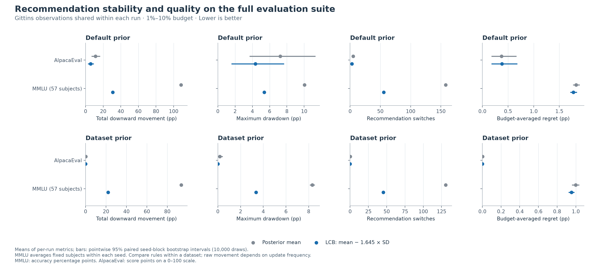

# Gittins + LCB on AlpacaEval and the full MMLU suite

**LCB is more temporally stable in every one of the 57 MMLU subjects under both priors**: it reduces mean total downward movement, maximum drawdown, largest drop, and switches. Average recommendation quality also improves across the suite, with subject-level exceptions.

AlpacaEval also has less movement with LCB. Its dataset-prior runs are already nearly stable with posterior mean, so the remaining improvement has an interval touching zero. Both methods finish with zero regret in every AlpacaEval run.

This comparison uses **2,320 paired Gittins trajectories**: AlpacaEval and
57 MMLU subjects, each with 20 sampling seeds and two priors.
Posterior-mean recommendation and **LCB = mean − 1.645 × posterior SD** see
exactly the same observations in each trajectory. Only the recommendation rule
changes; Gittins continues to choose which arm to evaluate.

The primary robustness measures are total downward movement, maximum drawdown,
largest downward jump, and recommendation switches. Recommendation quality is
reported alongside stability: a consistently poor arm could be perfectly stable.

## Setup and scope

- This is an **offline replay of the existing saved reward matrices**. No new
  LLM generations or evaluator calls were made.
- The allocation and LCB coefficient follow the earlier experiments without tuning
  on these new results. Sampling is uniform without replacement within an arm.
- Runs use the existing NumPy/SciPy Gittins backend, cost scale `1e-4`, per-cell
  observation variance `0.25`, and the default `N(0.5, 0.04)` prior plus each
  dataset's existing prior. The second Normal parameter is variance.
- MMLU optimizes an arm **separately for each subject**. The primary suite result
  averages subject-level metrics equally within each sampling seed. It does not
  select one global arm for concatenated MMLU questions. A question-count-weighted
  average is included as a secondary summary.
- The stability window begins at the recommendation active at 1% of matrix cells
  and includes every later batch update through the actual rounded endpoint,
  capped at 10%. Checkpoints use the last completed batch at or before the nominal
  budget; no future observation is interpolated.
- MMLU movements and regret are **accuracy percentage points**. AlpacaEval uses
  the saved evaluator score matrix; its movements are **score points on a 0–100
  scale**, not automatically literal accuracy or win-rate percentage points.

AlpacaEval has 153 arms × 805 examples, batch 16, and an exact final budget of 12,316 cells (9.9995940%). Its dataset prior is `N(0.2, 0.01)`. MMLU uses batch 4 and the existing subject-prior buckets.

MMLU covers all 14,042 saved questions across 57 subjects, with 1,500 arms per subject.

## Aggregate stability and quality

Every cell is **posterior mean → LCB**. Lower is better for all metrics below.

| Dataset / prior | Total down (pp) | Max drawdown (pp) | Switches | Largest drop (pp) | Mean regret (pp) | Final regret (pp) |
|---|---:|---:|---:|---:|---:|---:|
| AlpacaEval / default | 11.165 → 5.624 | 7.244 → 4.346 | 5.000 → 2.850 | 6.945 → 4.011 | 0.374 → 0.380 | 0.000 → 0.000 |
| AlpacaEval / dataset | 0.174 → 0.000 | 0.174 → 0.000 | 0.200 → 0.000 | 0.174 → 0.000 | 0.001 → 0.000 | 0.000 → 0.000 |
| MMLU: equal subject average / default | 108.287 → 30.907 | 10.030 → 5.388 | 158.003 → 55.664 | 9.439 → 5.075 | 1.828 → 1.774 | 0.828 → 0.826 |
| MMLU: equal subject average / dataset | 93.575 → 22.004 | 8.316 → 3.364 | 130.705 → 45.391 | 7.961 → 3.201 | 0.999 → 0.954 | 0.436 → 0.400 |

Here and in compact figure axes, 'pp' denotes accuracy percentage points for MMLU and score points for AlpacaEval.

### Paired evidence and interpretation

- **AlpacaEval, default prior:** total downward movement decreases; LCB − posterior = **-5.540**, paired 95% interval **[-9.324, -2.288]**. The budget-averaged regret difference is +0.006 [-0.007, +0.022].
- **AlpacaEval, dataset prior:** total downward movement decreases; LCB − posterior = **-0.174**, paired 95% interval **[-0.434, +0.000]**. The budget-averaged regret difference is -0.001 [-0.002, +0.000].
- **MMLU: equal subject average, default prior:** total downward movement decreases; LCB − posterior = **-77.380**, paired 95% interval **[-79.261, -75.472]**. The budget-averaged regret difference is -0.055 [-0.071, -0.037].
- **MMLU: equal subject average, dataset prior:** total downward movement decreases; LCB − posterior = **-71.571**, paired 95% interval **[-72.544, -70.513]**. The budget-averaged regret difference is -0.045 [-0.060, -0.029].

LCB improves the mean in 16/16 aggregate dataset/prior/primary-stability comparisons; 12 have a pointwise paired 95% interval entirely below zero. These counts concern stability, not a claim that every quality metric improves.

## How consistent is the result across MMLU subjects?

Counts compare each subject's mean over paired seeds. 'Worse' is a positive LCB − posterior difference; ties use absolute tolerance `1e-10`. Counts do not imply subject-level statistical significance.

| Metric | Default: better / tie / worse | Dataset: better / tie / worse |
|---|---:|---:|
| Total downward movement (pp) | 57 / 0 / 0 | 57 / 0 / 0 |
| Maximum drawdown (pp) | 57 / 0 / 0 | 57 / 0 / 0 |
| Recommendation switches | 57 / 0 / 0 | 57 / 0 / 0 |
| Largest downward jump (pp) | 57 / 0 / 0 | 57 / 0 / 0 |
| Budget-averaged drawdown (pp) | 56 / 0 / 1 | 57 / 0 / 0 |
| Budget-averaged regret (pp) | 46 / 0 / 11 | 52 / 0 / 5 |
| Final regret (pp) | 12 / 35 / 10 | 12 / 44 / 1 |
| Harmful jumps | 57 / 0 / 0 | 57 / 0 / 0 |
| Jumps of at least 2 pp | 56 / 1 / 0 | 56 / 1 / 0 |
| Risk of any jump of at least 2 pp | 45 / 12 / 0 | 47 / 10 / 0 |

### Largest quality regressions

The table lists the five largest mean-regret increases per prior, including their uncertainty. Every positive metric difference is retained in the regression CSV.

| Prior | Subject | Mean regret: posterior → LCB (pp) | Difference (95% paired interval) |
|---|---|---:|---:|
| default | us foreign policy | 1.506 → 1.852 | +0.346 [-0.006, +0.993] |
| default | jurisprudence | 1.465 → 1.577 | +0.113 [+0.018, +0.263] |
| default | college computer science | 3.595 → 3.689 | +0.094 [-0.127, +0.419] |
| default | human sexuality | 1.155 → 1.225 | +0.070 [-0.017, +0.214] |
| default | college biology | 0.862 → 0.929 | +0.067 [-0.010, +0.215] |
| dataset | formal logic | 1.472 → 1.579 | +0.108 [-0.033, +0.280] |
| dataset | college chemistry | 2.772 → 2.837 | +0.065 [-0.061, +0.251] |
| dataset | high school government and politics | 0.175 → 0.182 | +0.008 [+0.006, +0.010] |
| dataset | medical genetics | 0.879 → 0.881 | +0.001 [-0.001, +0.004] |
| dataset | high school us history | 0.575 → 0.575 | +0.000449 [-0.018, +0.034] |

### Question-weighted sensitivity check

| Prior | Metric | Posterior → LCB | Difference (95% paired interval) |
|---|---|---:|---:|
| default | Total downward movement (pp) | 165.797 → 39.674 | -126.123 [-130.351, -122.021] |
| default | Maximum drawdown (pp) | 9.683 → 4.205 | -5.479 [-5.732, -5.216] |
| default | Budget-averaged regret (pp) | 1.153 → 1.100 | -0.053 [-0.062, -0.044] |
| default | Final regret (pp) | 0.420 → 0.416 | -0.004 [-0.016, +0.009] |
| dataset | Total downward movement (pp) | 116.958 → 25.891 | -91.068 [-93.663, -88.806] |
| dataset | Maximum drawdown (pp) | 7.475 → 2.578 | -4.897 [-5.224, -4.557] |
| dataset | Budget-averaged regret (pp) | 0.636 → 0.598 | -0.038 [-0.046, -0.030] |
| dataset | Final regret (pp) | 0.233 → 0.212 | -0.021 [-0.032, -0.011] |

## Recommendation quality at fixed budgets

Regret is the full-row score of the best arm minus that of the recommended arm.

| Dataset / prior | 1% | 2% | 5% | 10% |
|---|---:|---:|---:|---:|
| AlpacaEval / default | 3.431 → 3.210 | 2.035 → 2.035 | 0.000 → 0.000 | 0.000 → 0.000 |
| AlpacaEval / dataset | 0.000 → 0.000 | 0.000 → 0.000 | 0.000 → 0.000 | 0.000 → 0.000 |
| MMLU: equal subject average / default | 3.547 → 3.413 | 2.850 → 2.778 | 1.704 → 1.648 | 0.828 → 0.826 |
| MMLU: equal subject average / dataset | 2.540 → 2.514 | 1.483 → 1.428 | 1.015 → 0.966 | 0.436 → 0.400 |

## Metric definitions and uncertainty

Let `r_t` be oracle full-row regret at each real recommendation update, beginning
with the state active at 1%. Oracle scores evaluate the result only; they are
never exposed to either recommendation rule.

- **Total downward movement:** `100 × sum(max(r_t − r_(t−1), 0))`; repeated
  deterioration accumulates and can exceed 100 points.
- **Maximum drawdown:** `100 × max(r_t − min_(s<=t) r_s)`; the largest decline
  from the best recommendation reached since the window began.
- **Largest downward jump:** `100 × max(max(r_t − r_(t−1), 0))`.
- **Switches:** changes in arm identity, including harmless switches.
- **Budget-averaged drawdown / regret:** exact step-function integral divided
  by the window width; an update at the endpoint has zero exposure time.
- **Harmful jumps / jumps of at least 2 points / any such jump:** counts and an
  event indicator. The mean event indicator is a risk on a 0–1 scale. The 2-point
  threshold is inclusive with tolerance `1e-12` in raw score units.
- **Final regret:** quality at the window's last observed state.

All ten metrics reuse the earlier frozen `analyze_stability.path_metrics`
implementation. Metrics are computed within each run before any averaging.
MMLU's primary result is the equal-subject mean for each seed; the secondary
result weights subjects by their question counts. **The bootstrap resamples
whole sampling-seed blocks, retaining every fixed subject and both rules**.
It uses 10,000 resamples with seed 20260913. Curves use 2,000 of those resamples
for pointwise shading. The p90 in each aggregate row is the 90th percentile
of the seed-level subject aggregate; it is not a pooled subject/run tail.

Intervals are pointwise, unadjusted, and conditional on these fixed matrices.
They describe variation in sampling paths, not uncertainty over new questions,
new subjects, models, or prompts. The earlier analysis motivated these metrics
and the 1%–10% window; the three MMLU subjects examined earlier are repeated
within this complete suite and are not independent new evidence. Tail estimates
from only 20 seeds are coarse. Neither the Gaussian LCB model nor these
experiments guarantees universal temporal stability or better accuracy.

Do not compare datasets' raw switch or movement totals as if their evaluation
frequencies were identical: matrix dimensions and batch sizes differ. Within
each paired comparison, those factors are held fixed.

## Validation and provenance

The [compact engine parity tests](test_full_suite_engine.py) compare against the frozen `experiment_core` implementation. Separately, seed-0 trajectories for the three previously studied MMLU subjects were matched exactly.

The independent auditor rebuilds observed counts and reward sums and replays every sampled cell, every Gittins allocation, both recommendations, and their saved scores, variances, and oracle regrets. It also checks input/source hashes, unique observations, exact budgets, and the complete seed grid. See the [suite audit summary](results/full_suite/audit_summary.json) and the per-dataset audit links below. This is a full trajectory audit, not a sampled-step check.

Root-table generation is checked separately in the [portable backend validation](results/portable_validation.json). The analysis manifest records hashes of every source trace and experiment manifest.

## Artifacts

- [Aggregate overview](figures/full_suite/overview.png)
- [Quality curves](figures/full_suite/quality_curves.png)
- [Every per-run metric](figures/full_suite/per_run_metrics.csv)
- [Per-subject means, tails, and intervals](figures/full_suite/per_subject_summary.csv)
- [Aggregate paired bootstrap intervals](figures/full_suite/aggregate_summary.csv)
- [Every positive metric difference](figures/full_suite/regressions.csv)
- [Checkpoint summary and intervals](figures/full_suite/checkpoint_summary.csv)
- [Raw per-run checkpoints](figures/full_suite/per_run_checkpoints.csv)
- [Analysis configuration and source hashes](figures/full_suite/manifest.json)
- [All-subject effects heatmap](figures/full_suite/mmlu_subject_effects.png)
- [Stability versus quality scatter](figures/full_suite/mmlu_stability_quality_tradeoff.png)

### Individual comparison figures

- [AlpacaEval](figures/full_suite/per_subject/alpaca_eval.png) · [audit](results/full_suite/alpaca_eval/validation.json)
- [MMLU: Abstract Algebra](figures/full_suite/per_subject/mmlu_abstract_algebra.png) · [audit](results/full_suite/mmlu_abstract_algebra/validation.json)
- [MMLU: Anatomy](figures/full_suite/per_subject/mmlu_anatomy.png) · [audit](results/full_suite/mmlu_anatomy/validation.json)
- [MMLU: Astronomy](figures/full_suite/per_subject/mmlu_astronomy.png) · [audit](results/full_suite/mmlu_astronomy/validation.json)
- [MMLU: Business Ethics](figures/full_suite/per_subject/mmlu_business_ethics.png) · [audit](results/full_suite/mmlu_business_ethics/validation.json)
- [MMLU: Clinical Knowledge](figures/full_suite/per_subject/mmlu_clinical_knowledge.png) · [audit](results/full_suite/mmlu_clinical_knowledge/validation.json)
- [MMLU: College Biology](figures/full_suite/per_subject/mmlu_college_biology.png) · [audit](results/full_suite/mmlu_college_biology/validation.json)
- [MMLU: College Chemistry](figures/full_suite/per_subject/mmlu_college_chemistry.png) · [audit](results/full_suite/mmlu_college_chemistry/validation.json)
- [MMLU: College Computer Science](figures/full_suite/per_subject/mmlu_college_computer_science.png) · [audit](results/full_suite/mmlu_college_computer_science/validation.json)
- [MMLU: College Mathematics](figures/full_suite/per_subject/mmlu_college_mathematics.png) · [audit](results/full_suite/mmlu_college_mathematics/validation.json)
- [MMLU: College Medicine](figures/full_suite/per_subject/mmlu_college_medicine.png) · [audit](results/full_suite/mmlu_college_medicine/validation.json)
- [MMLU: College Physics](figures/full_suite/per_subject/mmlu_college_physics.png) · [audit](results/full_suite/mmlu_college_physics/validation.json)
- [MMLU: Computer Security](figures/full_suite/per_subject/mmlu_computer_security.png) · [audit](results/full_suite/mmlu_computer_security/validation.json)
- [MMLU: Conceptual Physics](figures/full_suite/per_subject/mmlu_conceptual_physics.png) · [audit](results/full_suite/mmlu_conceptual_physics/validation.json)
- [MMLU: Econometrics](figures/full_suite/per_subject/mmlu_econometrics.png) · [audit](results/full_suite/mmlu_econometrics/validation.json)
- [MMLU: Electrical Engineering](figures/full_suite/per_subject/mmlu_electrical_engineering.png) · [audit](results/full_suite/mmlu_electrical_engineering/validation.json)
- [MMLU: Elementary Mathematics](figures/full_suite/per_subject/mmlu_elementary_mathematics.png) · [audit](results/full_suite/mmlu_elementary_mathematics/validation.json)
- [MMLU: Formal Logic](figures/full_suite/per_subject/mmlu_formal_logic.png) · [audit](results/full_suite/mmlu_formal_logic/validation.json)
- [MMLU: Global Facts](figures/full_suite/per_subject/mmlu_global_facts.png) · [audit](results/full_suite/mmlu_global_facts/validation.json)
- [MMLU: High School Biology](figures/full_suite/per_subject/mmlu_high_school_biology.png) · [audit](results/full_suite/mmlu_high_school_biology/validation.json)
- [MMLU: High School Chemistry](figures/full_suite/per_subject/mmlu_high_school_chemistry.png) · [audit](results/full_suite/mmlu_high_school_chemistry/validation.json)
- [MMLU: High School Computer Science](figures/full_suite/per_subject/mmlu_high_school_computer_science.png) · [audit](results/full_suite/mmlu_high_school_computer_science/validation.json)
- [MMLU: High School European History](figures/full_suite/per_subject/mmlu_high_school_european_history.png) · [audit](results/full_suite/mmlu_high_school_european_history/validation.json)
- [MMLU: High School Geography](figures/full_suite/per_subject/mmlu_high_school_geography.png) · [audit](results/full_suite/mmlu_high_school_geography/validation.json)
- [MMLU: High School Government And Politics](figures/full_suite/per_subject/mmlu_high_school_government_and_politics.png) · [audit](results/full_suite/mmlu_high_school_government_and_politics/validation.json)
- [MMLU: High School Macroeconomics](figures/full_suite/per_subject/mmlu_high_school_macroeconomics.png) · [audit](results/full_suite/mmlu_high_school_macroeconomics/validation.json)
- [MMLU: High School Mathematics](figures/full_suite/per_subject/mmlu_high_school_mathematics.png) · [audit](results/full_suite/mmlu_high_school_mathematics/validation.json)
- [MMLU: High School Microeconomics](figures/full_suite/per_subject/mmlu_high_school_microeconomics.png) · [audit](results/full_suite/mmlu_high_school_microeconomics/validation.json)
- [MMLU: High School Physics](figures/full_suite/per_subject/mmlu_high_school_physics.png) · [audit](results/full_suite/mmlu_high_school_physics/validation.json)
- [MMLU: High School Psychology](figures/full_suite/per_subject/mmlu_high_school_psychology.png) · [audit](results/full_suite/mmlu_high_school_psychology/validation.json)
- [MMLU: High School Statistics](figures/full_suite/per_subject/mmlu_high_school_statistics.png) · [audit](results/full_suite/mmlu_high_school_statistics/validation.json)
- [MMLU: High School Us History](figures/full_suite/per_subject/mmlu_high_school_us_history.png) · [audit](results/full_suite/mmlu_high_school_us_history/validation.json)
- [MMLU: High School World History](figures/full_suite/per_subject/mmlu_high_school_world_history.png) · [audit](results/full_suite/mmlu_high_school_world_history/validation.json)
- [MMLU: Human Aging](figures/full_suite/per_subject/mmlu_human_aging.png) · [audit](results/full_suite/mmlu_human_aging/validation.json)
- [MMLU: Human Sexuality](figures/full_suite/per_subject/mmlu_human_sexuality.png) · [audit](results/full_suite/mmlu_human_sexuality/validation.json)
- [MMLU: International Law](figures/full_suite/per_subject/mmlu_international_law.png) · [audit](results/full_suite/mmlu_international_law/validation.json)
- [MMLU: Jurisprudence](figures/full_suite/per_subject/mmlu_jurisprudence.png) · [audit](results/full_suite/mmlu_jurisprudence/validation.json)
- [MMLU: Logical Fallacies](figures/full_suite/per_subject/mmlu_logical_fallacies.png) · [audit](results/full_suite/mmlu_logical_fallacies/validation.json)
- [MMLU: Machine Learning](figures/full_suite/per_subject/mmlu_machine_learning.png) · [audit](results/full_suite/mmlu_machine_learning/validation.json)
- [MMLU: Management](figures/full_suite/per_subject/mmlu_management.png) · [audit](results/full_suite/mmlu_management/validation.json)
- [MMLU: Marketing](figures/full_suite/per_subject/mmlu_marketing.png) · [audit](results/full_suite/mmlu_marketing/validation.json)
- [MMLU: Medical Genetics](figures/full_suite/per_subject/mmlu_medical_genetics.png) · [audit](results/full_suite/mmlu_medical_genetics/validation.json)
- [MMLU: Miscellaneous](figures/full_suite/per_subject/mmlu_miscellaneous.png) · [audit](results/full_suite/mmlu_miscellaneous/validation.json)
- [MMLU: Moral Disputes](figures/full_suite/per_subject/mmlu_moral_disputes.png) · [audit](results/full_suite/mmlu_moral_disputes/validation.json)
- [MMLU: Moral Scenarios](figures/full_suite/per_subject/mmlu_moral_scenarios.png) · [audit](results/full_suite/mmlu_moral_scenarios/validation.json)
- [MMLU: Nutrition](figures/full_suite/per_subject/mmlu_nutrition.png) · [audit](results/full_suite/mmlu_nutrition/validation.json)
- [MMLU: Philosophy](figures/full_suite/per_subject/mmlu_philosophy.png) · [audit](results/full_suite/mmlu_philosophy/validation.json)
- [MMLU: Prehistory](figures/full_suite/per_subject/mmlu_prehistory.png) · [audit](results/full_suite/mmlu_prehistory/validation.json)
- [MMLU: Professional Accounting](figures/full_suite/per_subject/mmlu_professional_accounting.png) · [audit](results/full_suite/mmlu_professional_accounting/validation.json)
- [MMLU: Professional Law](figures/full_suite/per_subject/mmlu_professional_law.png) · [audit](results/full_suite/mmlu_professional_law/validation.json)
- [MMLU: Professional Medicine](figures/full_suite/per_subject/mmlu_professional_medicine.png) · [audit](results/full_suite/mmlu_professional_medicine/validation.json)
- [MMLU: Professional Psychology](figures/full_suite/per_subject/mmlu_professional_psychology.png) · [audit](results/full_suite/mmlu_professional_psychology/validation.json)
- [MMLU: Public Relations](figures/full_suite/per_subject/mmlu_public_relations.png) · [audit](results/full_suite/mmlu_public_relations/validation.json)
- [MMLU: Security Studies](figures/full_suite/per_subject/mmlu_security_studies.png) · [audit](results/full_suite/mmlu_security_studies/validation.json)
- [MMLU: Sociology](figures/full_suite/per_subject/mmlu_sociology.png) · [audit](results/full_suite/mmlu_sociology/validation.json)
- [MMLU: Us Foreign Policy](figures/full_suite/per_subject/mmlu_us_foreign_policy.png) · [audit](results/full_suite/mmlu_us_foreign_policy/validation.json)
- [MMLU: Virology](figures/full_suite/per_subject/mmlu_virology.png) · [audit](results/full_suite/mmlu_virology/validation.json)
- [MMLU: World Religions](figures/full_suite/per_subject/mmlu_world_religions.png) · [audit](results/full_suite/mmlu_world_religions/validation.json)
