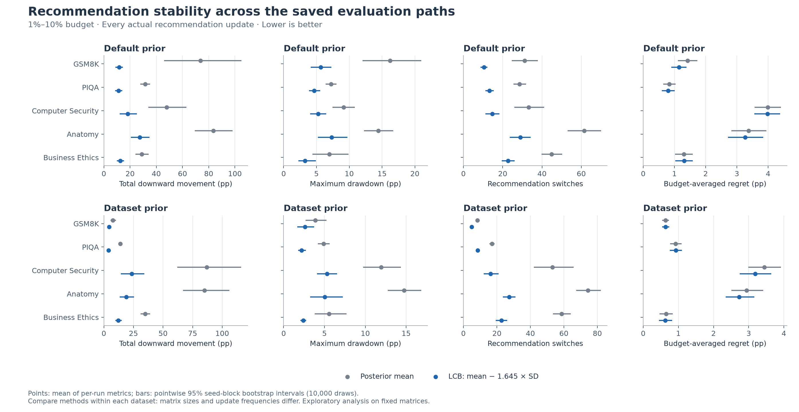

# Temporal recommendation stability — September 13, 2026

LCB (`mean − 1.645 × SD`) has less total downward movement, smaller maximum
drawdown, and fewer switches than posterior-mean recommendation in all ten
tested dataset/prior settings. This concerns temporal stability of the
recommendation rule on fixed Gittins observations, not a universal accuracy claim.

This analysis reuses all 520 saved trajectories (200 GSM8K + 200 PIQA + 120 MMLU).
The window is 1%–10% of the full matrix. Its initial state is the recommendation
already active at 1%; every actual subsequent batch update is included. No new
LLM calls or Gittins trajectories were needed. Both rules always recommend.

## Metric definitions

Let `q_t` be the recommended arm's full-row benchmark accuracy and
`r_t = q_best − q_t`. Each metric is computed within each run before aggregation.

- **Total downward movement:** `100 * sum(max(r_t − r_(t−1), 0))`.
  All harmful jumps accumulate. For accuracy 80% → 70% → 80% → 70%, this is
  20 pp, although the net loss is only 10 pp. It can exceed 100 pp.
- **Maximum drawdown:** `100 * max(r_t − min_(s<=t) r_s)`. This is the worst
  decline from the best recommendation reached since the window began.
- **Largest downward jump:** the biggest individual increase in regret, in pp.
- **Switches:** number of changes in arm identity, including harmless switches.
- **Budget-averaged drawdown:** drawdown integrated over evaluation budget and
  divided by the window width; captures the duration as well as size of setbacks.
- **Budget-averaged regret:** the same time-weighted calculation for regret;
  preserves the distinction between being stable and being consistently good.
- **Harmful jumps / jumps of at least 2 pp / any jump of at least 2 pp:** counts
  or per-run event indicators. The threshold includes exactly 2 pp, within
  floating-point tolerance. The summary mean of the event indicator is a risk.
- **Final regret:** recommendation quality at 10%, included as a separate
  accuracy check. A change exactly at 10% counts as a jump but has zero duration
  in the time-weighted metrics.

All movements use oracle full-row accuracy for evaluation only, not the evolving
posterior score. Areas hold the recommendation constant between actual updates;
there is no interpolation using future observations. No gap is treated as zero
movement: abstaining rules would need a separate analysis reporting coverage.

## Mean results

Every cell is **posterior mean → LCB**, averaging per-run quantities. Quality
movements are percentage points (pp); switches are counts. GSM8K/PIQA average
100 runs per prior; each MMLU subject averages 20.

### Default prior

| Dataset | Total downward movement (pp) | Maximum drawdown (pp) | Switches | Largest drop (pp) | Budget-averaged regret (pp) |
|---|---:|---:|---:|---:|---:|
| GSM8K | 73.611 → 11.581 | 16.236 → 5.655 | 31.110 → 10.400 | 13.945 → 5.364 | 1.424 → 1.143 |
| PIQA | 31.528 → 11.102 | 7.209 → 4.670 | 28.520 → 13.200 | 6.596 → 4.454 | 0.832 → 0.794 |
| Computer Security | 47.950 → 18.200 | 9.150 → 5.250 | 33.200 → 14.750 | 8.150 → 4.550 | 3.992 → 3.982 |
| Anatomy | 83.556 → 27.333 | 14.444 → 7.296 | 61.450 → 28.950 | 13.556 → 7.000 | 3.378 → 3.266 |
| Business Ethics | 28.950 → 12.550 | 6.950 → 3.250 | 44.900 → 22.750 | 6.400 → 2.950 | 1.300 → 1.311 |

### Dataset prior

| Dataset | Total downward movement (pp) | Maximum drawdown (pp) | Switches | Largest drop (pp) | Budget-averaged regret (pp) |
|---|---:|---:|---:|---:|---:|
| GSM8K | 7.630 → 4.358 | 3.881 → 2.614 | 8.380 → 4.940 | 3.847 → 2.614 | 0.635 → 0.638 |
| PIQA | 13.769 → 4.036 | 4.880 → 2.177 | 17.080 → 8.450 | 4.582 → 2.054 | 0.923 → 0.928 |
| Computer Security | 87.000 → 23.450 | 11.950 → 5.300 | 53.200 → 16.250 | 10.100 → 5.050 | 3.447 → 3.184 |
| Anatomy | 84.963 → 19.037 | 14.741 → 5.037 | 74.450 → 27.250 | 13.741 → 4.667 | 2.937 → 2.725 |
| Business Ethics | 35.000 → 12.250 | 5.550 → 2.400 | 58.600 → 22.750 | 5.150 → 2.200 | 0.649 → 0.628 |

## Paired effects on cumulative deterioration and drawdown

Negative differences favor LCB. These are differences of mean per-run metrics.

| Dataset | Prior | Total-downward difference [95% interval], pp | Drawdown difference [95% interval], pp |
|---|---|---:|---:|
| GSM8K | default | -62.030 [-93.181, -34.582] | -10.581 [-15.222, -6.408] |
| GSM8K | dataset | -3.272 [-4.416, -2.257] | -1.267 [-1.864, -0.685] |
| PIQA | default | -20.426 [-23.471, -17.574] | -2.539 [-3.083, -2.034] |
| PIQA | dataset | -9.733 [-11.161, -8.211] | -2.703 [-3.373, -2.117] |
| Computer Security | default | -29.750 [-38.651, -21.350] | -3.900 [-5.250, -2.600] |
| Computer Security | dataset | -63.550 [-83.100, -46.400] | -6.650 [-8.500, -4.950] |
| Anatomy | default | -56.222 [-67.963, -46.333] | -7.148 [-9.815, -4.778] |
| Anatomy | dataset | -65.926 [-83.259, -51.888] | -9.704 [-11.556, -7.852] |
| Business Ethics | default | -16.400 [-21.500, -11.900] | -3.700 [-6.550, -1.300] |
| Business Ethics | dataset | -22.750 [-27.100, -19.050] | -3.150 [-5.450, -1.250] |

## Tail behavior and frequency of large drops

Dataset priors; p90 is computed across individual runs, not updates. The CSV
contains the default-prior results too. These tail/risk estimates are descriptive.

| Dataset | P90 total downward movement, pp | P90 drawdown, pp | Probability of any ≥2 pp jump | Budget-averaged drawdown, pp |
|---|---:|---:|---:|---:|
| GSM8K | 19.740 → 13.010 | 11.990 → 10.640 | 48% → 22% | 0.064 → 0.049 |
| PIQA | 27.530 → 10.240 | 9.840 → 3.900 | 85% → 54% | 0.229 → 0.129 |
| Computer Security | 147.900 → 63.000 | 18.300 → 9.000 | 100% → 90% | 1.704 → 0.782 |
| Anatomy | 144.370 → 44.222 | 21.630 → 8.963 | 100% → 70% | 0.759 → 0.545 |
| Business Ethics | 46.400 → 22.200 | 13.100 → 4.000 | 100% → 80% | 0.501 → 0.439 |

## Interpretation and limitations

Lower cumulative deterioration means less repeated backtracking; smaller
drawdown means smaller setbacks from previously achieved quality. Those are
directly relevant to recommendations that jump as evaluations arrive. The
comparison is paired within each trajectory and does not claim a benefit from
changing the allocation policy to LCB.

With dataset priors, mean total downward movement falls by approximately
43%–78%. The paired intervals for its mean reduction, and for mean maximum
drawdown and switch counts, exclude zero in all ten dataset/prior settings.
These intervals remain exploratory and unadjusted.

The differences in budget-averaged regret are much smaller and sometimes favor
posterior mean: for example, dataset-prior PIQA is 0.923 → 0.928 pp, despite
its substantially lower movement. Budget-averaged drawdown decreases in all
ten settings, but its default-prior Business Ethics interval includes zero.
Thus fewer and smaller jumps do not imply improvement on every quality or
duration-sensitive metric.

The analysis window, metric family, and 2 pp event threshold were chosen
exploratorily after examining the experiments. Intervals are pointwise and
unadjusted for multiple comparisons. They resample 20 whole sampling-seed blocks
with replacement (10,000 draws, seed 20260913), retaining all fixed matrices and
both rules in each block. They describe Monte Carlo variation on these matrices,
not new datasets or questions. Tail estimates from 20 MMLU seeds are coarse.

Do not rank datasets by raw total movement or switch counts: their matrix
dimensions and batch sizes differ. Compare the paired rules within the same
dataset, prior, and budget window. A stable but poor arm could score perfectly
on movement, so budget-averaged and final regret are retained alongside stability.

## Files

- [Overview PNG](figures/stability/overview.png) / [PDF](figures/stability/overview.pdf)
- [Per-run metrics](figures/stability/per_run_metrics.csv)
- [Summary with paired intervals and p90s](figures/stability/summary.csv)
- [Analysis configuration and input hashes](figures/stability/manifest.json)

### Figures for every metric

- [Total downward movement (pp)](figures/stability/total_downward_pp.png)
- [Maximum drawdown (pp)](figures/stability/maximum_drawdown_pp.png)
- [Recommendation switches](figures/stability/switches.png)
- [Largest downward jump (pp)](figures/stability/largest_drop_pp.png)
- [Budget-averaged drawdown (pp)](figures/stability/mean_drawdown_pp.png)
- [Budget-averaged regret (pp)](figures/stability/mean_regret_pp.png)
- [Final regret (pp)](figures/stability/final_regret_pp.png)
- [Number of harmful jumps](figures/stability/downward_jumps.png)
- [Number of jumps of at least 2 pp](figures/stability/jumps_ge_2pp.png)
- [Probability of any jump of at least 2 pp](figures/stability/any_jump_ge_2pp.png)

